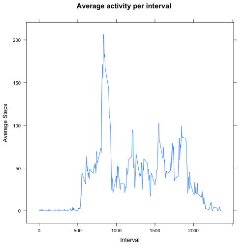

Activity Monitoring Analysis
========================================================

This R Markdown document is an analysis of the activity monitoring data.

Load the data

```r
data <- read.csv("activity.csv")
```


## Mean total number of steps taken per day
### Histogram of the number of steps

```r
data_clean <- na.omit(data)
summed <- aggregate(data_clean$steps, by = list(Date = data_clean$date), sum)
hist(summed$x, xlab = "Steps", main = "Histogram of total number of steps per day")
```

 

```r
summary(summed)
```

```
##          Date          x        
##  2012-10-02: 1   Min.   :   41  
##  2012-10-03: 1   1st Qu.: 8841  
##  2012-10-04: 1   Median :10765  
##  2012-10-05: 1   Mean   :10766  
##  2012-10-06: 1   3rd Qu.:13294  
##  2012-10-07: 1   Max.   :21194  
##  (Other)   :47
```


### Mean & Median of the total number of steps per day

```r
mean(summed$x)
```

```
## [1] 10766
```

```r
median(summed$x)
```

```
## [1] 10765
```


## Average daily activity pattern
### Time series plot for average activity per interval

```r
require(lattice)
```

```
## Loading required package: lattice
```

```r
avginterval <- aggregate(data_clean$steps, by = list(Interval = data_clean$interval), 
    mean)
xyplot(x ~ Interval, data = avginterval, type = "l", main = "Average activity per interval", 
    ylab = "Average Steps")
```

 

### Max 5-minute interval across all days

```r
avginterval[which.max(avginterval$x), 1]
```

```
## [1] 835
```


## Imputing Missing Data
### Total number of missing values

```r
sum(!complete.cases(data))
```

```
## [1] 2304
```


### Filling missing data

```r
require(plyr)
```

```
## Loading required package: plyr
```

```r
impute.mean <- function(x) replace(x, is.na(x), mean(x, na.rm = TRUE))
data_filled <- ddply(data, ~interval, transform, steps = impute.mean(steps))
data_filled <- data_filled[order(data_filled$date), ]
```


### Histogram of total steps each day for imputed data

```r
summed_filled <- aggregate(data_filled$steps, by = list(Date = data_filled$date), 
    sum)
hist(summed_filled$x, xlab = "Steps", main = "Histogram of total number of steps per day")
```

 

```r
summary(summed_filled)
```

```
##          Date          x        
##  2012-10-01: 1   Min.   :   41  
##  2012-10-02: 1   1st Qu.: 9819  
##  2012-10-03: 1   Median :10766  
##  2012-10-04: 1   Mean   :10766  
##  2012-10-05: 1   3rd Qu.:12811  
##  2012-10-06: 1   Max.   :21194  
##  (Other)   :55
```

### Mean & Median of the total number of steps per day for imputed data

```r
mean(summed_filled$x)
```

```
## [1] 10766
```

```r
median(summed_filled$x)
```

```
## [1] 10766
```


## Difference in activity patterns between weekdays and weekends
### Create weekday and weekend factors

```r
data_filled$weekdays <- weekdays(as.Date(data_filled$date))
data_filled$weekdays[data_filled$weekdays %in% c("Saturday", "Sunday")] <- "weekend"
data_filled$weekdays[!data_filled$weekdays %in% c("weekend")] <- "weekday"
data_filled$weekdays <- as.factor(data_filled$weekdays)
str(data_filled)
```

```
## 'data.frame':	17568 obs. of  4 variables:
##  $ steps   : num  1.717 0.3396 0.1321 0.1509 0.0755 ...
##  $ date    : Factor w/ 61 levels "2012-10-01","2012-10-02",..: 1 1 1 1 1 1 1 1 1 1 ...
##  $ interval: int  0 5 10 15 20 25 30 35 40 45 ...
##  $ weekdays: Factor w/ 2 levels "weekday","weekend": 1 1 1 1 1 1 1 1 1 1 ...
```


### Time series plot for average activity

```r
require(lattice)
steps_by_weekdays <- aggregate(data_filled$steps, by = list(weekdays = data_filled$weekdays, 
    interval = data_filled$interval), mean)
xyplot(x ~ interval | weekdays, type = "l", data = steps_by_weekdays, xlab = "Interval", 
    ylab = "Number of steps", layout = c(1, 2))
```

 

